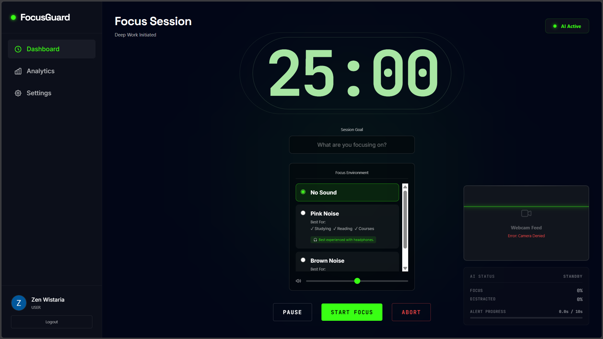

# 🟢 FocusGuard

> **Deep Work Initiated.** An AI-powered, visually aggressive focus environment built to destroy distractions.

**🚀 Live Demo:** [https://focusguard-26.netlify.app/](https://focusguard-26.netlify.app/)



## The 'Why'

Most focus timers are passive—they just count down while you tab away to social media. **FocusGuard is different.** It actively enforces your concentration using client-side AI vision and a relentless Distraction Escalation Pipeline. If you look away from your screen or lose focus, the system knows, warns you, and actively forces you back into the zone. 

## Features

- **Real-time AI Vision:** Powered by TensorFlow.js and MediaPipe. 100% client-side execution means your webcam data never leaves your browser.
- **Distraction Escalation Pipeline:** A dynamic state machine that visually and audibly escalates (via the Web Audio API) from a subtle warning to a full alert if you remain distracted.
- **Frictionless Onboarding:** 1-click Google OAuth login to get you straight into deep work.
- **Neo-Minimalist UI:** A highly polished, distraction-free interface built with Tailwind CSS, utilizing glassmorphism and subtle neon accents.
- **Zero Layout Thrashing:** DOM elements are cached upon initialization, guaranteeing a buttery-smooth 60fps experience even while the AI model runs continuously.

## Architecture (Under the Hood)

FocusGuard runs on a fully modular, zero-build-step vanilla JavaScript architecture. The logic is cleanly decoupled into a unified namespace (`window.FocusGuard`), divided across four core modules:

- `pomodoro-core.js`: The State & Timer engine. Handles the strict focus state machine and the Distraction Escalation logic.
- `pomodoro-ui.js`: The Telemetry & Theme manager. Responsibly caches DOM elements and controls dynamic visual transitions based on AI confidence.
- `pomodoro-settings.js`: The Webcam & Audio controller. Interfaces with device hardware and the Web Audio API for custom alarms.
- `pomodoro-reporter.js`: The Score calculator. Generates deep insights and calculates a focus penalty score based on session telemetry.

## Local Setup

To run FocusGuard locally on your machine, clone the repository and start a simple local web server:

```bash
git clone https://github.com/marzhendo/Focus-Guard.git
cd Focus-Guard
python -m http.server 5500
```

> **Note:** For Google Sign-In to work locally, ensure you whitelist `http://localhost:5500` inside your Google Cloud Console OAuth configuration.

## About the Developer

**Designed and engineered by Marzhendo Galang Saputra.**

I am deeply passionate about clean software architecture, practical applications of AI, and crafting highly polished, modern UI/UX experiences. 